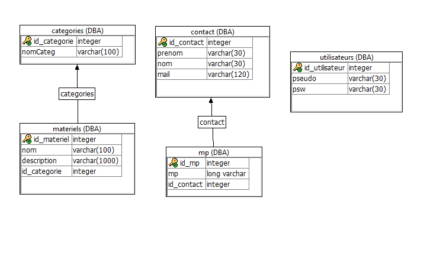

# projet-juin-2020
Site pour une ASBL de location de matériel son/lumière.

# Présentation de l'équipe 
-Diego Marting Lenoir

-Derwa Alexandre (créateur de l'ASBL)

-Louis Carlier

-Dallenogare Corentin (créateur de l'ASBL)

# Description du projet
Le projet est un site d'une ASBL proposant des services de location de matériel son et lumière.
Le site est une vitrine du matériel proposé à la location et permet de rentrer en contact avec l'ASBL
pour une éventuelle location

# Aspects implémentés
-1: Création de l'HTML en fonction des articles présents dans la base de donnée. 
-
    Cela comprend la liste des catégories, les différentes photos et noms du matériel ainsi que les fenêtres de descriptions.
-2: Récuperation des noms, prénoms, mails et messages des utilisateurs du site.
-
    Les utilisateurs peuvent laisser un message avec leurs coordonnées.
-3: Interface de connexion admin.
-
    Les administrateurs peuvent se connecter pour accèder à d'autres fonctionnalitées.
-4: Possibilité d'ajouter des articles.
-
    Les administrateurs peuvent rajouter des articles dans la base de donnée.
-5: Possibilité d'affiché les messages reçus.
-
    Les administrateurs peuvent regarder les messages et utilisateurs présents dans la base de donnée.
  
# Détail api rest 
-ajout : Permet d'ajouter du matériel dans la BDD
-
    Il prend un nom d'article, une description et une id de catégorie en paramètre.
    Il insère ensuite les données dans la BDD (type = RAW)
    Auteur = Diego 
-ajoutPersonne : Permet d'ajouter des personnes/messages dans la BDD.
-
    Il prend un nom, un prénom, un email et un message en paramètre.
    Il insère ensuite les données dans la BDD (type = RAW)
      => Si la personne est déja présente dans la BDD il n'insère que le message (fait appel à la fonction verification).
    Auteur = Alexandre
-categorie : Permet de créer un tableau d'objet de catégories.
-
    Il ne prend rien en paramètre.
    Il récupère les catégories présentes dans la BDD et les envoit sous forme de tableau d'objet (type = JSON )
    Auteur = Corentin
-creation : Permet de créer un tableau d'objet d'id, de nom, de description et de nom de catégorie.
-
    Il ne prend rien en paramètre.
    Il récupère les id d'objets, les nom des produits, les descriptions des produits et les catégories des produits
    présents dans la BDD. Il envoie ensuite cela sous forme de tableau d'objet (type = JSON )
    Auteur = Corentin
-messages : Permet de créer une chaine html des clients ainsi que de leurs messages.
-
    Il ne prend rien en paramètre.
    Il récupère les noms, prénoms et messages des clients et les renvoies sous forme de chaine html (type= RAW)
    Utilise un group by.
    Auteur = Corentin
-userConnexion : permet la connexion des administrateurs à la BDD.
-
    Il ne prend rien en paramètre.
    Il récupère les pseudos et mots de passes dans la BDD (type = JSON)
    Auteur = Louis
-fonction verification : permet de verifier si un client est dans la base de donnée.
-
    Elle prend en paramètre un char(50) qui est le mail du client.
    Elle retourne NULL si le client n'est pas dans la BDD et l'id_contact si il est présent.
    Auteur = commun
    
# Détail DB
  -categories :
  -
    Il s'agit de la table des catégories.
    pk = id_categorie.
    Cette table comprend deux collones :
        id_categorie qui est auto incrémentée et est un entié.
        nomCateg qui est un varchar(100) regrouppant les noms des catégories. 
  -contact :
  -
    Il sagit de la tables des clients.
    pk = id_contact.
    Cette table comprend quattres collones :
        id_contact qui est auto incrémentée et est un entié.
        nom qui est un varchar(30) regrouppant les noms des clients. 
        prenom qui est un varchar(30) regrouppant les prénoms des clients. 
        mail qui est un varchar(100) regrouppant les adresses emais des clients. 
  -materiels :
  -
    Il sagit de la tables du matériel disponible à la location.
    pk = id_materiel.
    Cette table comprend quattres collones :
        id_materiel qui est auto incrémentée et est un entié.
        id_categorie qui est auto incrémentée et est un entié. 
        description qui est un varchar(1000) regrouppant les descriptions des produits disponibles. 
        nom qui est un varchar(100) regrouppant les noms des produits disponibles.   
  -mp :
  -
    Il sagit de la tables des messages clients présents dans la BDD.
    pk = id_mp.
    Cette table comprend trois collones :
        id_mp qui est auto incrémentée et est un entié.
        id_contact qui est auto incrémentée et est un entié. 
        mp qui est un long varchar, il est le message du client. 
  -utilisateurs :
  -
    Il sagit de la tables des utilisateurs administrateurs de la BDD.
    pk = id_utilisateur.
    Cette table comprend trois collones :
        id_utilisateur qui est auto incrémentée et est un entié.
        pseudo qui est un varchar(30) regrouppant les pseudos des administrateurs. 
        psw qui est un varchar(30) regrouppant les mots de passes des administrateurs.       
          
# Schéma relationnel :
  -
    
          
